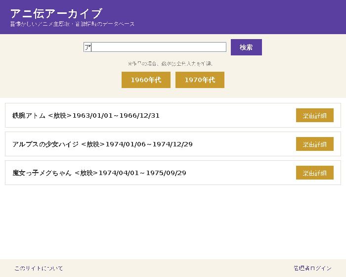
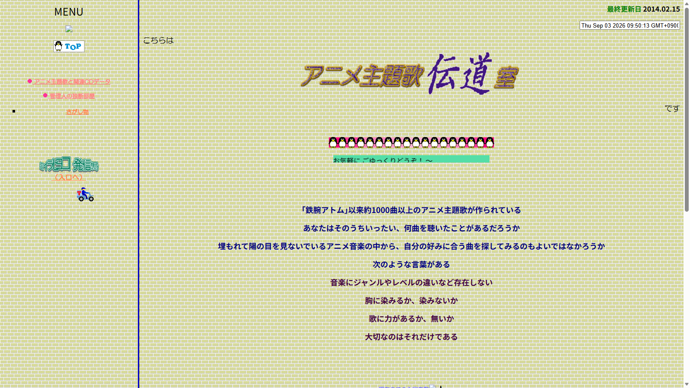
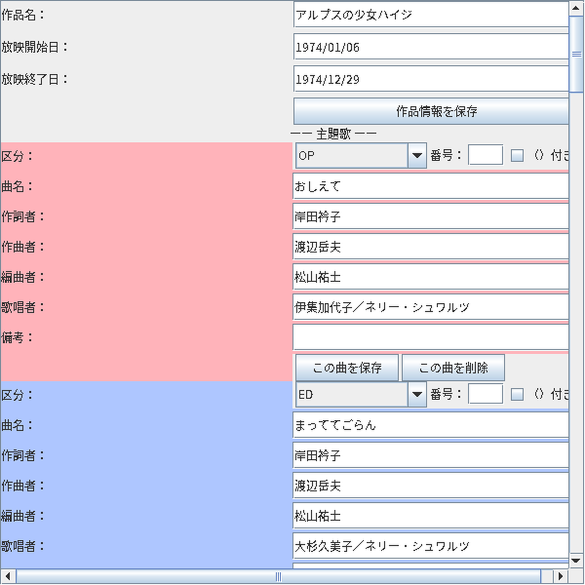
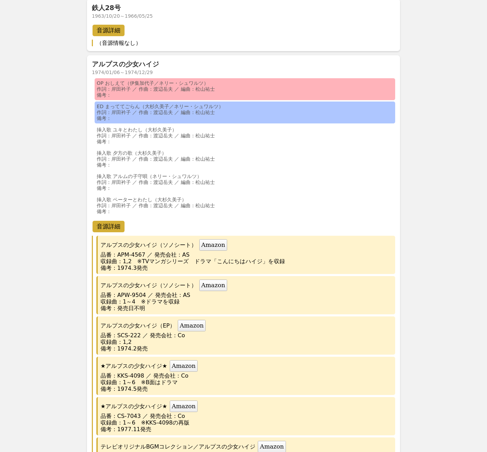
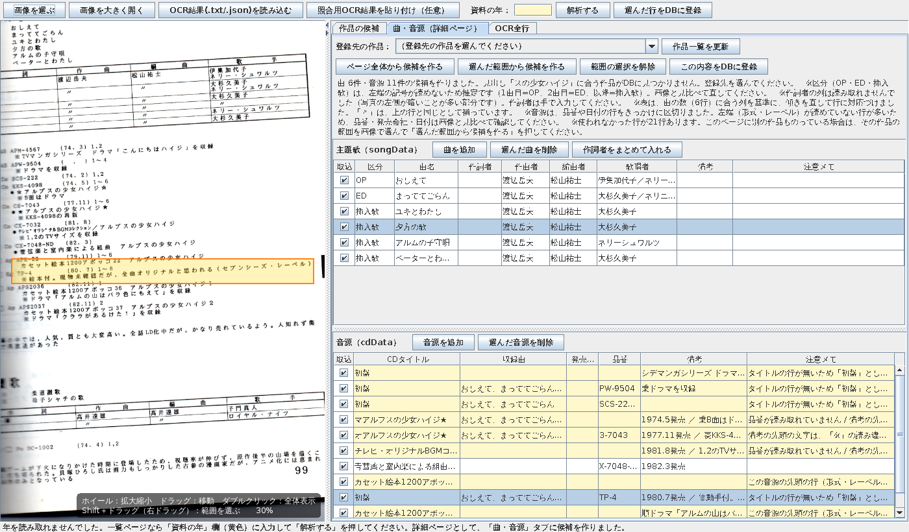
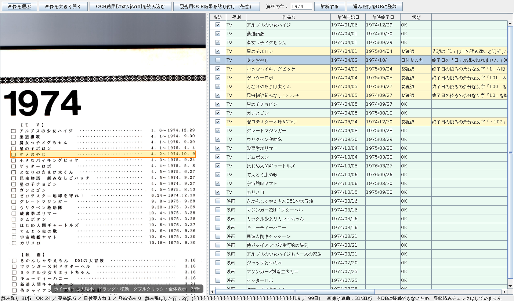

# アニ伝アーカイブ

むかし自分で運営していたアニメ主題歌の情報サイトを、Javaで作り直したデータベースアプリです。

職業訓練校の「統合開発演習」という課題として作り、就職活動用のポートフォリオも兼ねています。



---

## 目次

- [作ったきっかけ](#作ったきっかけ)
- [できること](#できること)
- [Before → After](#before--after)
- [工夫したところ・苦労したところ](#工夫したところ苦労したところ)
- [使用技術](#使用技術)
- [クラス構成](#クラス構成)
- [動かし方](#動かし方)
- [データについて（重要）](#データについて重要)
- [今後やりたいこと](#今後やりたいこと)

---

## 作ったきっかけ

「アニメ主題歌伝道室」は、むかし私が自分で運営していたサイトです。

アニメの主題歌には、TVで実際に流れた「本物」の音源と、似ているだけの別物（カバー・再録音など）があり、見分けがつきにくいことがあります。「TVオリジナル」と表記されていても、実はアレンジや歌手が違う、ということも少なくありません。そうした違いを整理して案内するために、このサイトを始めました。

そのサイトは今はもう見られなくなってしまいましたが、今回、**データベースを使った新しいアプリとして復活**させました。

## できること

| 機能 | 内容 |
|---|---|
| 検索 | 作品名・曲名・CD情報など、すべての項目からキーワードで検索 |
| 年代さがし | 年代 → 年のボタンから、作品を絞り込んで一覧表示 |
| 楽曲・音源詳細 | 作詞・作曲・編曲・歌唱者、CDの品番・発売会社などを表示 |
| Amazon検索 | CDタイトルから、Amazonの検索結果へ直接リンク |
| 管理者機能 | ログインして、作品・曲・CD情報の追加／編集／削除（論理削除・復活つき） |
| 色分け表示 | OP／EDなど区分ごとに、背景色を自動で変える |
| HTML版の書き出し | ボタン1つで、ブラウザだけで見られる静的ページを生成（サーバー不要） |
| 資料の取り込み（OCR） | 資料本の写真を読み込み、曲・CD情報の候補を自動作成。画像の位置と連動して確認できる |

## Before → After

| むかしのサイト | 今回作ったアプリ |
|---|---|
|  |  |

ブラウザだけで見られるHTML版も、同じデータベースから書き出せます。



## 工夫したところ・苦労したところ

### 資料本の文字を、自動で読み取りたい

手元の資料本には、まだデータベースに入力していない作品がたくさん残っています。1件ずつ手で入力するのは大変なので、**OCR（文字認識）で資料の写真から自動で読み取る**ことに挑戦しました。

最初は定番のOCRソフト「Tesseract」を使いましたが、写真の傾きや点線・丸数字の多さに弱く、ほとんど読める文字になりませんでした。そこで、国立国会図書館が公開している、日本語の本を読むのが得意な「NDLOCR-Lite」に切り替えたところ、精度が大きく上がりました。

それでも読み取りの間違いは残るので、**読み取った行をクリックすると、画像のその場所へ自動でジャンプして確認できる、確認・修正用のツール**を自作しました。




### 表の行と、曲の対応づけ

資料の表（作詞・作曲・編曲・歌唱者）は、OCRでの読み取り精度にばらつきがあり、曲の数と表の項目数がぴったり合わないことがよくあります。合わないときに無理に当てはめて間違ったデータを作ってしまうより、**自信を持って判断できないときは空欄のまま残し、人の目で確認してもらう**、という方針にしています。

### プログラムの整理

最初は1つの巨大なファイルに全部書いていましたが、役割ごとに `Database` / `TopWindow` / `AdminWindow` / `MainApp` の4つに分割しました。見返しやすく、説明もしやすくなりました。

## 使用技術

- **言語**：Java 21
- **GUI**：Java Swing
- **データベース**：SQLite（[sqlite-jdbc](https://github.com/xerial/sqlite-jdbc)）
- **OCR**：[NDLOCR-Lite](https://github.com/ndl-lab)（国立国会図書館）
- **開発環境**：Eclipse（Pleiades）
- **配布形式**：[jpackage](https://docs.oracle.com/en/java/javase/21/jpackage/) による、Java不要で動くWindows用app-image（exe）

## クラス構成

```
jp.example
├─ MainApp.java         起動役（Database接続 → TopWindow表示）
├─ Database.java        SQLiteへの接続だけを担当
├─ TopWindow.java        一般ユーザー向けのTOP画面（検索・年代さがし）
├─ AdminWindow.java      管理者向けの画面（ログイン・編集・HTML書き出し）
├─ AboutContent.java     「このサイトについて」の文章（アプリ版・HTML版で共通）
├─ OcrReviewApp.java     資料取り込みツールのメイン画面
├─ OcrJson.java          NDLOCR-LiteのJSON（座標つき読み取り結果）を読む
├─ OcrLineParser.java    一覧ページ（作品名・放映期間）をOCR結果から解析
├─ OcrDetailParser.java  詳細ページ（曲・CD情報）をOCR結果から解析
├─ DetailPanel.java      OCR候補の確認・編集・DB登録画面
└─ ImagePanel.java       画像の拡大縮小・範囲選択・ハイライト表示
```

## 動かし方

### 必要なもの

- Java 21（[Eclipse Temurin](https://adoptium.net/) など）
- [sqlite-jdbc](https://github.com/xerial/sqlite-jdbc/releases) のjarファイル

### Eclipseで動かす場合

1. このリポジトリをクローンし、Eclipseにインポートします。
2. `sqlite-jdbc-x.xx.x.jar` を、プロジェクトのビルド・パスに追加します（プロジェクトを右クリック → ビルド・パス → ビルド・パスの構成 → ライブラリー → 外部JARの追加）。
3. [`schema.sql`](schema.sql) を使って空の `test.db` を作成し、プロジェクト直下に置きます（詳しくは[データについて](#データについて重要)を参照）。
4. `MainApp.java` を実行します。

### exe（Windows用）を作る場合

`build_app.bat` を使うと、jpackageで、Javaのインストールが無くても動くexe（app-image）を作れます。使い方はファイル内のコメントを参照してください。

## データについて（重要）

このリポジトリには、**ソースコードのみを公開しており、実際の作品・曲・CDデータ（`test.db`の中身）は含めていません**。これらは、市販の資料集などをもとに作成したデータであり、著作権に配慮して非公開としています。

お試しで動かす場合は、同梱の [`schema.sql`](schema.sql) を使って、空の `test.db` をご自身で作成してください。作品や曲のデータは、ご自身の資料などから入力してお試しください。

## 今後やりたいこと

- AIでもっと自動化（画像を見せて、そのまま表の形で答えてもらう仕組み）
- 1980年代以降への対応
- 外部サーバーへの公開・データベースアプリとしての提供
- この開発経験の、実際の仕事への応用

---

このプロジェクトは、職業訓練校「統合開発演習」の課題として制作しました。
